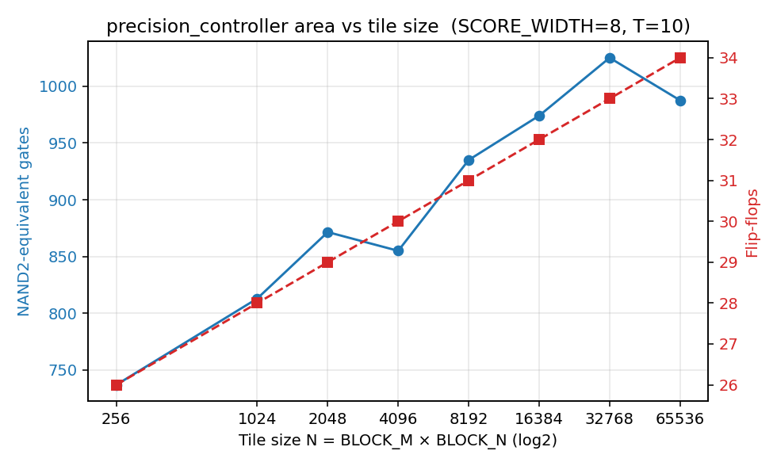
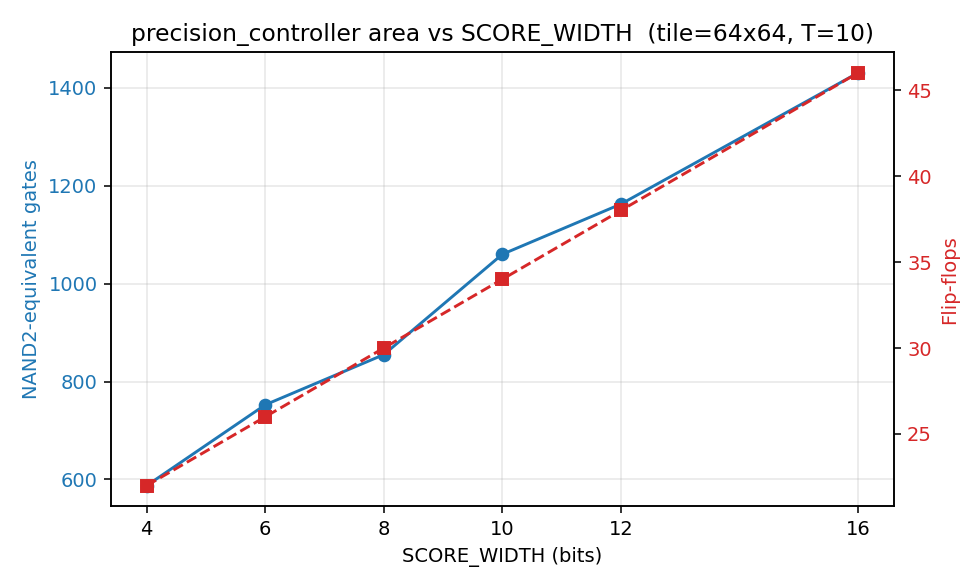

# precision_controller — Yosys sweep notes

Tool: Yosys 0.9 (apt) · `synth -flatten` then `abc -fast -g NAND`.
NAND2-equivalent counted as `NAND + NOT/2`.

## Headline findings

1. **Tile cost is logarithmic, not linear.** Going from 16×16 (N=256) to 256×256
   (N=65536) — a 256× increase in tile area — adds only **34% more gates**
   (737 → 987 NAND2-eq) and **8 FFs** (26 → 34). The architectural reason: the
   only state that widens with N is `sum_acc` (width SCORE_WIDTH + log₂N), and
   the only logic that widens is the comparator, which scales O(log N) too.
   The decision overhead is essentially flat across realistic FlashAttention
   tile sizes.

2. **FF count matches the analytical formula exactly.**
   `FFs = 2·SCORE_WIDTH + log₂(N) + 2`  (max_acc + sum_acc + d_valid + d_fp16).
   At every sweep point, post-synth FFs equal the closed form — no inferred
   state, no synth surprises. This is the cleanest signal that the RTL is
   doing exactly what the architecture says it should.

3. **Bit-width is the dominant cost driver, not tile size.**
   At fixed tile=64×64, going SCORE_WIDTH 4 → 16 bits more than doubles area
   (587 → 1430 NAND2-eq, 22 → 46 FFs).
   Going SCORE_WIDTH 8 → 12 (a plausible "more headroom" choice) costs +36%
   gates and +8 FFs. The fixed-point sim already showed 8b is sufficient; the
   sweep quantifies the opportunity cost of going wider.

4. **Absolute area is small.** At our reference config (64×64 tile, 8b scores)
   the controller is **30 FFs + 855 NAND2-eq gates**. Sky130 / TSMC 28nm
   per-cell estimates put total area at well under **1000 µm²**, which is
   negligible next to a single FP16 MAC (~1500 µm² in 28nm) and far below
   the surrounding attention MAC array (8×8 INT8 array ≈ 50–100k µm²).

## Caveats

- Yosys 0.9 + `abc -fast`: the 128×256 → 256×256 dip (1025 → 988 NAND2-eq) is
  abc-mapping noise, not a real area reduction. `abc -fast` is heuristic; a
  full `abc -g NAND` or newer Yosys (≥0.45) would smooth this and likely give
  a few % lower numbers across the board.
- "NAND2-equivalent" here is `NAND + NOT/2` — a textbook shorthand. A real
  Liberty-mapped flow (sky130 / asap7 / TSMC 28nm) is needed for actual µm²
  and pJ numbers.
- This is *standalone* synthesis. When integrated into a larger attention
  pipeline, retiming and shared registers may shrink the absolute count.

## Tile-size sweep (SCORE_WIDTH = 8)

| BLOCK_M | BLOCK_N | N | LOG2_N | SUM_W | CMP_W | FF | NAND | NOT | NAND2_eq |
|---|---|---|---|---|---|---|---|---|---|
| 16 | 16 | 256 | 8 | 16 | 20 | 26 | 591 | 292 | 737.0 |
| 32 | 32 | 1024 | 10 | 18 | 22 | 28 | 653 | 320 | 813.0 |
| 32 | 64 | 2048 | 11 | 19 | 23 | 29 | 697 | 349 | 871.5 |
| 64 | 64 | 4096 | 12 | 20 | 24 | 30 | 686 | 338 | 855.0 |
| 64 | 128 | 8192 | 13 | 21 | 25 | 31 | 744 | 382 | 935.0 |
| 128 | 128 | 16384 | 14 | 22 | 26 | 32 | 778 | 392 | 974.0 |
| 128 | 256 | 32768 | 15 | 23 | 27 | 33 | 817 | 416 | 1025.0 |
| 256 | 256 | 65536 | 16 | 24 | 28 | 34 | 790 | 395 | 987.5 |

## SCORE_WIDTH sweep (tile = 64x64)

| SCORE_WIDTH | SUM_W | CMP_W | FF | NAND | NOT | NAND2_eq |
|---|---|---|---|---|---|---|
| 4 | 16 | 20 | 22 | 470 | 235 | 587.5 |
| 6 | 18 | 22 | 26 | 602 | 301 | 752.5 |
| 8 | 20 | 24 | 30 | 686 | 338 | 855.0 |
| 10 | 22 | 26 | 34 | 847 | 426 | 1060.0 |
| 12 | 24 | 28 | 38 | 932 | 461 | 1162.5 |
| 16 | 28 | 32 | 46 | 1148 | 565 | 1430.5 |

